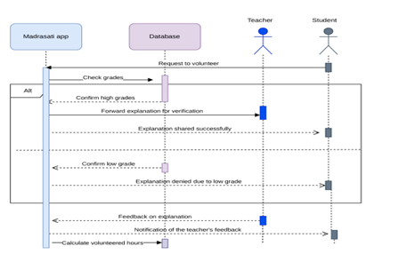

# 🏫 Madrasati Application Enhancement (SWE)

## 📌 Project Overview
This project focuses on the systematic analysis and architectural enhancement of the **Madrasati** educational application[cite: 13]. [cite_start]The primary goal is to improve teacher-student communication and streamline educational workflows by proposing new features and verifying the system's scalability[cite: 13].

## 🚀 Proposed Features & Enhancements
- [cite_start]**Intelligent Feedback Loop:** A system allowing students to share explanations with teachers and receive direct feedback and graded evaluations[cite: 13].
- [cite_start]**Volunteer Hour Tracking:** Automated calculation of volunteered hours for students based on their contributions within the app[cite: 13].
- [cite_start]**AI Chatbot Integration:** A messaging feature that utilizes a database-driven chatbot to provide instant answers to student queries[cite: 13].

## 🛠️ Software Modeling (UML)
[cite_start]The project emphasizes rigorous design through **Sequence Diagrams** to illustrate system logic[cite: 13]. Below is a detailed view of the communication workflow:

## 📁 Repository Structure
- [cite_start]`Documentation/`: Contains the full software engineering project report (`SWE_Project_Madrasati.pdf`) featuring all milestones and design diagrams[cite: 13].

## 👥 The Team
[cite_start]Developed by Computer Science students at **King Faisal University**[cite: 13]:
- **Atekah Hussain Aljafar**
- Ghaidaa Hussain
- Anfal Ahmad
- Zainab Abdulkarim
- **Supervised by:** Dr. Sharmila Banu Sheik Imam

---
[cite_start]*Part of the Fundamental of Software Engineering Course - KFU (February 2024)*[cite: 13].
---
*Connect with me on LinkedIn for more projects!*
[https://www.linkedin.com/in/ateka-hussain/](https://www.linkedin.com/in/ateka-hussain/)
